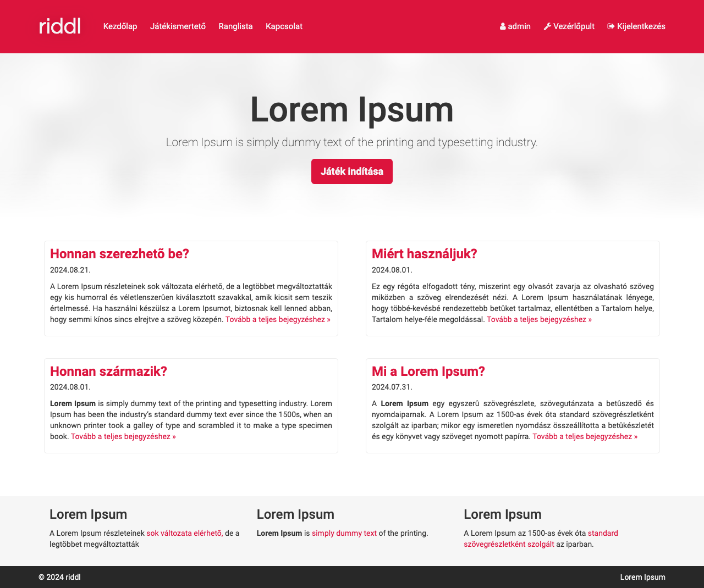

# Riddl (WordPress sablon)

A **Riddl** egy egyedi WordPress sablon, amelyet kifejezetten a Riddl játék oldalához készült. 

## Leírás

Ez a sablon célzottan a Riddl játék oldalához készült, és testreszabott funkciókat kínál a játék egyszerű és hatékony megjelenítéséhez WordPress környezetben. Továbbá olyan oldalakkal is kibővíti a vezérlőpulban található menüt, amelyekkel szerkeszthető és módosítható a játék tartalma és konfigurációja.

## Telepítés

A sablon telepítése egyszerű:

1. Másold a sablon mappáját a WordPress oldalad `wp-content/themes` mappájába.
2. Lépj be a WordPress admin felületére.

## Használat

A sablon aktiválása a következő lépésekkel végezhető el:

1. A WordPress vezérlőpultján navigálj a **Megjelenés** menüpontra.
2. Válaszd ki a **Sablonok** almenüt.
3. Keresd meg a **Riddl** sablont a listában, majd kattints az **Aktiválás** gombra.

## Követelmények

- WordPress 6.6.1 vagy újabb verzió.

## Képernyőképek

